# angle_only

**A modern C++20 library for angle-only target tracking, passive ranging, and multi-sensor fusion.**

Angle-only tracking estimates target positions and velocities using bearing measurements (azimuth and elevation) from one or more passive sensors — without any range information. This library provides a complete pipeline from raw angular detections through filtering, data association, multi-sensor triangulation, and fused track output.

---

## What Is Angle-Only Tracking?

In many surveillance and tracking scenarios, sensors measure only the *direction* to a target — not the distance. Radar can measure range, but passive sensors (ESM, IRST, sonar, optical) provide only angular bearings:

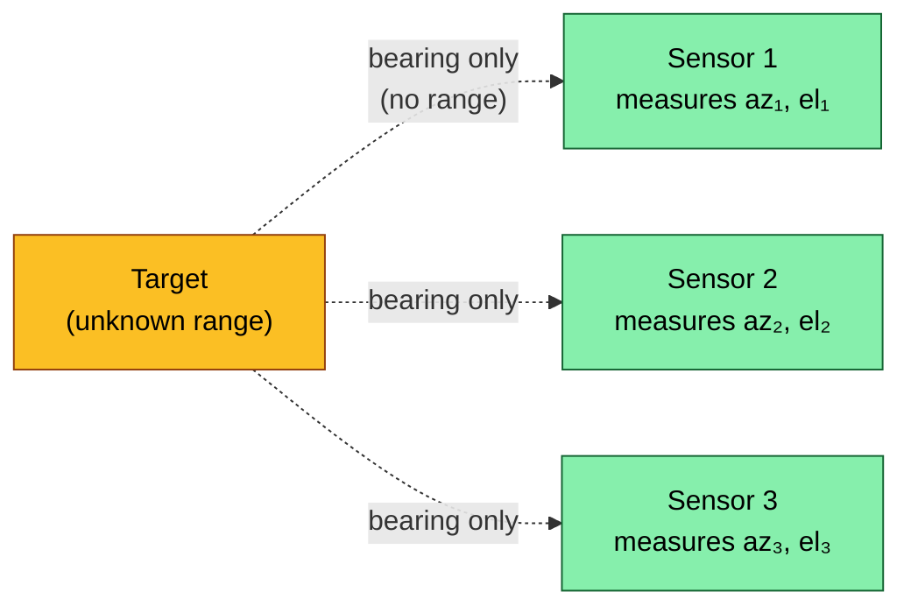

**Why is this hard?**

- A single bearing measurement defines a *line of sight* (LOS) — the target could be anywhere along that ray
- Range is **unobservable** from a stationary single sensor with constant-velocity target
- Range becomes observable through **sensor manoeuvre** (geometry change) or **multi-sensor triangulation**
- The relationship between Cartesian state and angular measurements is **highly nonlinear**
- Standard Kalman filters in Cartesian coordinates perform poorly — **Modified Spherical Coordinates (MSC)** avoid coordinate singularities

This library implements the full angle-only tracking pipeline using MSC-parameterized Extended Kalman Filters, line-of-sight triangulation, and multi-target PHD filtering.

---

## Architecture Overview

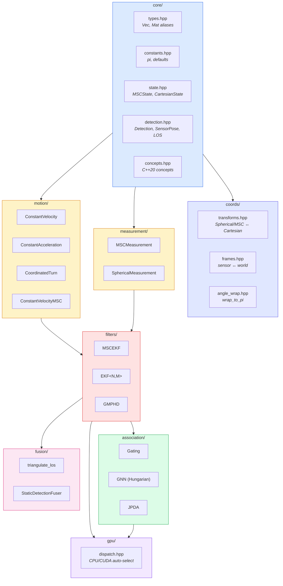

---

## Filter Pipeline

The core tracking loop follows a predict-correct cycle with data association and optional multi-sensor fusion:

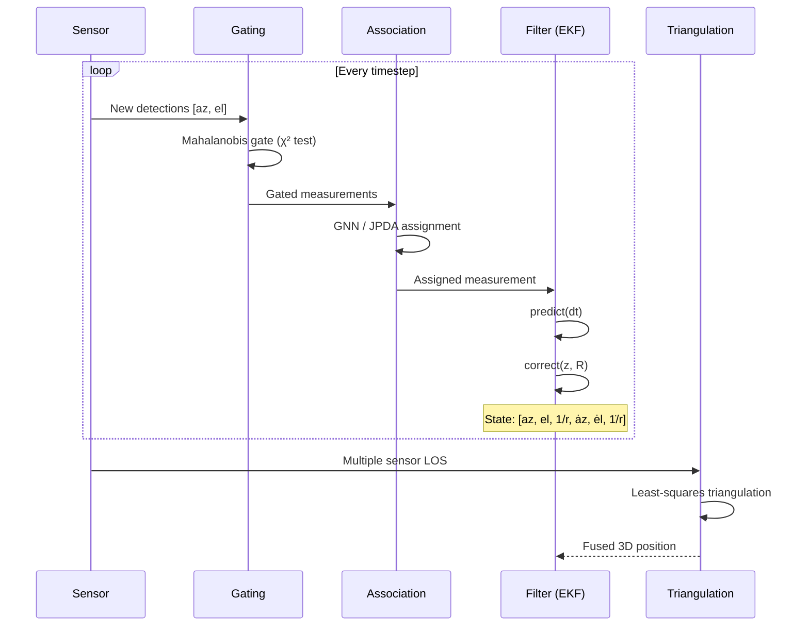

---

## Modified Spherical Coordinates (MSC)

The MSC parameterization is central to angle-only tracking. Instead of Cartesian `[x, y, z]`, the target state is represented as:

| State | Symbol | Description |
|-------|--------|-------------|
| Azimuth | `az` | Bearing angle in horizontal plane |
| Elevation | `el` | Bearing angle above horizon |
| Inverse range | `1/r` | Reciprocal of slant range |
| Azimuth rate | `az_dot` | Angular velocity in azimuth |
| Elevation rate | `el_dot` | Angular velocity in elevation |
| Inverse range rate | `inv_r_dot` | Rate of change of 1/r |

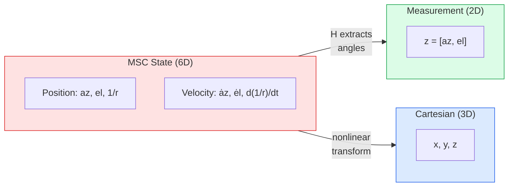

**Why MSC?**

- Angles are **directly observed** — the measurement model `H` is nearly linear
- Inverse range `1/r` avoids singularities at `r → ∞` (unknown range)
- Process noise couples naturally in the angular domain
- MATLAB's `trackingMSCEKF` uses this exact parameterization — this library is a compatible C++ implementation

---

## Data Flow

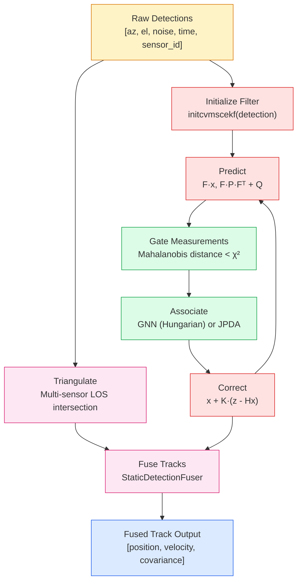

---

## Key Components

### Core (`aot::`)

| Class/Struct | Description |
|-------------|-------------|
| `MSCState` | 6D state vector + 6x6 covariance in Modified Spherical Coordinates |
| `CartesianState` | 6D state vector + 6x6 covariance in Cartesian coordinates |
| `Detection` | Angular measurement: azimuth, elevation, noise covariance, time, sensor ID |
| `SensorPose` | Sensor position, velocity, orientation (rotation matrix) |
| `LOSMeasurement` | Line-of-sight: origin point + unit direction vector |

### Coordinate Transforms (`aot::coords::`)

| Function | Description |
|----------|-------------|
| `spherical_to_cartesian` | `(az, el, r) → [x, y, z]` |
| `cartesian_to_spherical` | `[x, y, z] → (az, el, r)` |
| `msc_to_cartesian` | `(az, el, 1/r) → [x, y, z]` |
| `cartesian_to_msc` | `[x, y, z] → (az, el, 1/r)` |
| `sensor_to_world` / `world_to_sensor` | Frame transformations |
| `wrap_to_pi` / `angle_diff` | Angle wrapping utilities |

### Motion Models (`aot::motion::`)

| Class | State Dim | Description |
|-------|-----------|-------------|
| `ConstantVelocity` | 6 | Linear motion `[x,y,z,vx,vy,vz]` |
| `ConstantAcceleration` | 9 | `[x,y,z,vx,vy,vz,ax,ay,az]` |
| `CoordinatedTurn` | 7 | `[x,y,z,vx,vy,vz,ω]` with turn rate |
| `ConstantVelocityMSC` | 6 | `[az,el,1/r,ȧz,ėl,d(1/r)/dt]` — MATLAB compatible |

All models implement: `predict(state, dt)`, `jacobian(state, dt)`, `process_noise(dt)`

### Measurement Models (`aot::measurement::`)

| Class | Description |
|-------|-------------|
| `MSCMeasurement` | Extracts `[az, el]` from MSC state (near-linear H) |
| `SphericalMeasurement` | Computes `[atan2(y,x), asin(z/r)]` from Cartesian state |

### Filters (`aot::filters::`)

| Class | Description |
|-------|-------------|
| `MSCEKF` | Extended Kalman Filter in MSC. Predict, correct, JPDA correct, distance, likelihood, RTS smoother |
| `EKF<StateDim, MeasDim>` | Generic template EKF for arbitrary state/measurement dimensions |
| `GMPHD` | Gaussian Mixture PHD filter for multi-target tracking with unknown target count |

### Association (`aot::association::`)

| Function/Class | Description |
|----------------|-------------|
| `mahalanobis_distance` | Statistical distance for gating |
| `gate` | Ellipsoidal gating with χ² threshold |
| `gnn_assign` | Global Nearest Neighbor via Hungarian algorithm |
| `auction_assign` | Auction algorithm (faster for sparse problems) |
| `jpda_probabilities` | Joint Probabilistic Data Association weights |

### Fusion (`aot::fusion::`)

| Function/Class | Description |
|----------------|-------------|
| `triangulate_los` | Least-squares intersection of multiple lines of sight |
| `StaticDetectionFuser` | Multi-sensor detection clustering and triangulation |

### GPU Acceleration (`aot::gpu::`)

| Function | Description |
|----------|-------------|
| `batch_predict` | Batch state prediction (auto CPU/CUDA) |
| `batch_correct` | Batch measurement correction |
| `batch_likelihood` | Batch likelihood computation |
| `batch_triangulate` | Batch LOS triangulation |
| `batch_gating` | Batch Mahalanobis gating |

---

## Class Hierarchy

```mermaid
classDiagram
    class MotionModel {
        <<concept>>
        +predict(state, dt) VecX
        +jacobian(state, dt) MatXR
        +process_noise(dt) MatXR
    }

    class MeasurementModel {
        <<concept>>
        +predict(state) VecX
        +jacobian(state) MatXR
        +noise() MatXR
    }

    class TrackingFilter {
        <<concept>>
        +predict(dt)
        +correct(z, R)
        +state() VecX
        +covariance() MatXR
        +distance(z, R) double
        +likelihood(z, R) double
    }

    class ConstantVelocity {
        -process_noise_intensity: double
        +predict(state, dt) Vec6
        +jacobian(state, dt) Mat6
        +process_noise(dt) Mat6
    }

    class ConstantAcceleration {
        +predict(state, dt) Vec~9~
        +jacobian(state, dt) Mat~9x9~
    }

    class CoordinatedTurn {
        +predict(state, dt) Vec~7~
        +jacobian(state, dt) Mat~7x7~
    }

    class ConstantVelocityMSC {
        +predict(state, dt) Vec6
        +jacobian(state, dt) Mat6
    }

    class MSCMeasurement {
        +predict(state) Vec2
        +jacobian(state) Mat2x6
    }

    class SphericalMeasurement {
        +predict(state) Vec2
        +jacobian(state) Mat2x6
    }

    class MSCEKF {
        -state_: MSCState
        +predict(dt)
        +correct(z, R)
        +correct_jpda(measurements, weights, R)
        +smooth() vector~Vec6~
        +distance(z, R) double
        +likelihood(z, R) double
    }

    class EKF~StateDim_MeasDim~ {
        +set_transition(f, jac, Q)
        +set_measurement(h, jac)
        +predict(dt)
        +correct(z, R)
    }

    class GMPHD {
        -components_: vector~GaussianComponent~
        +predict(dt)
        +correct(measurements)
        +merge()
        +prune()
        +extract() vector~GaussianComponent~
        +estimated_target_count() double
    }

    MotionModel <|.. ConstantVelocity
    MotionModel <|.. ConstantAcceleration
    MotionModel <|.. CoordinatedTurn
    MotionModel <|.. ConstantVelocityMSC
    MeasurementModel <|.. MSCMeasurement
    MeasurementModel <|.. SphericalMeasurement
    TrackingFilter <|.. MSCEKF
    TrackingFilter <|.. EKF~StateDim_MeasDim~
```

---

## GPU Acceleration

Batch operations automatically dispatch to CUDA when available and the batch size exceeds the threshold:

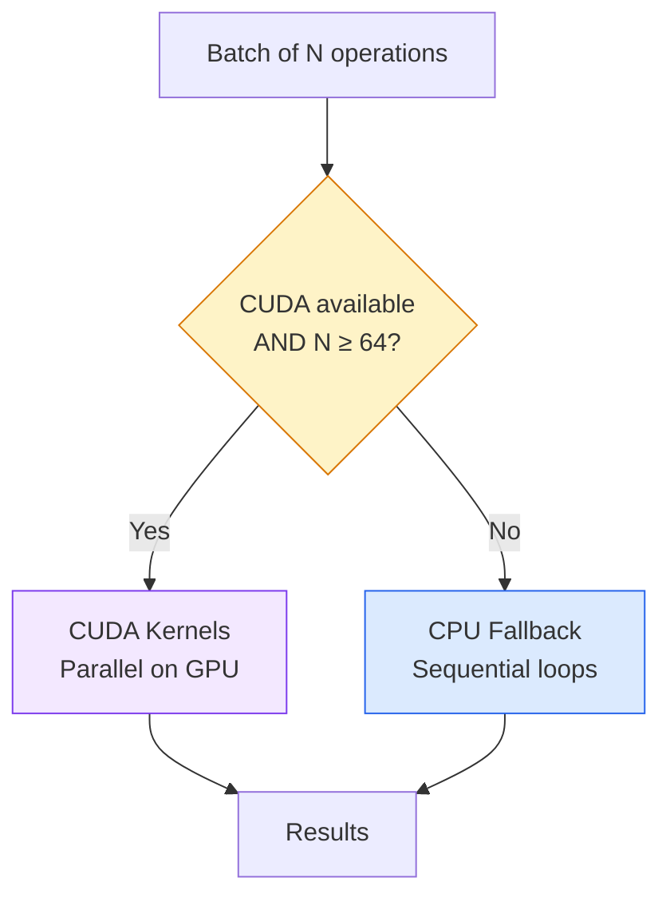

Build with `-DAOT_ENABLE_CUDA=ON` to enable GPU support. The CPU fallback is always available.

---

## Quick Start

### Build (C++)

```bash
# Clone and build
git clone <repo-url> angle_only
cd angle_only
cmake -B build
cmake --build build

# Run tests (54 tests)
cd build && ctest --output-on-failure
```

### Build with Python Bindings

```bash
cmake -B build -DAOT_BUILD_PYTHON=ON
cmake --build build
```

### C++ Example — Passive Ranging

```cpp
#include <angle_only/angle_only.hpp>

using namespace aot;
using namespace aot::filters;

int main() {
    // Create a detection from sensor measurement
    Detection det;
    det.azimuth = 0.3;          // radians
    det.elevation = 0.1;
    det.noise = 1e-4 * Mat2::Identity();
    det.time = 0.0;
    det.sensor_id = 1;

    // Initialize MSC-EKF from detection
    auto ekf = initcvmscekf(det, /*initial_inv_range=*/0.01,
                                  /*inv_range_std=*/0.05);

    // Tracking loop
    for (int k = 1; k <= 100; ++k) {
        double dt = 1.0;
        ekf.predict(dt);

        // New measurement
        Vec2 z;
        z << new_azimuth, new_elevation;
        Mat2 R = 1e-4 * Mat2::Identity();
        ekf.correct(z, R);

        // Access state
        auto state = ekf.state();    // [az, el, 1/r, az_dot, el_dot, inv_r_dot]
        double range = 1.0 / state(2);
    }
}
```

### C++ Example — Multi-Sensor Triangulation

```cpp
#include <angle_only/angle_only.hpp>
using namespace aot;
using namespace aot::fusion;

// Three sensors observe the same target
std::vector<LOSMeasurement> los;
for (auto& [pose, det] : sensor_detection_pairs) {
    LOSMeasurement m;
    m.origin = pose.position;
    m.direction = coords::az_el_to_unit_vector(det.azimuth, det.elevation);
    m.noise = det.noise;
    los.push_back(m);
}

auto result = triangulate_los(los);
if (result.valid) {
    Vec3 target_pos = result.position;   // 3D position
    Mat3 cov = result.covariance;         // uncertainty
}
```

### Python Example

```python
import angle_only as aot

# Initialize filter from a detection
det = aot.core.Detection()
det.azimuth = 0.3
det.elevation = 0.1
det.noise = 1e-4 * np.eye(2)

ekf = aot.MSCEKF.from_detection(det, initial_inv_range=0.01)

# Track
for z_az, z_el in measurements:
    ekf.predict(dt=1.0)
    ekf.correct([z_az, z_el], R=1e-4 * np.eye(2))

print(f"Estimated range: {1.0 / ekf.state[2]:.1f} m")
```

---

## Test Results

All 54 C++ tests pass across 9 test modules:

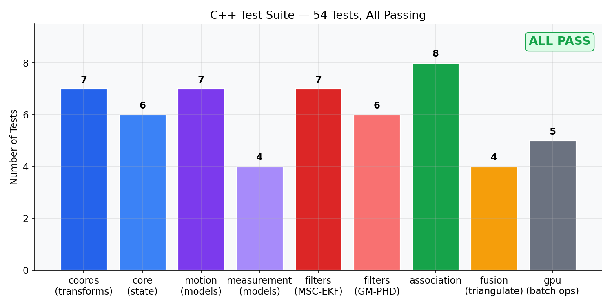

---

## Graphical Demonstrations

The following plots are generated by `scripts/generate_plots.py` using pure Python implementations that mirror the C++ library algorithms.

### Passive Ranging Convergence

A single sensor on a manoeuvring platform tracks a target using angle-only measurements. The EKF is initialized with a range estimate at 2x the true value. As the sensor manoeuvre creates geometric diversity, the range estimate converges toward truth and the uncertainty band narrows:

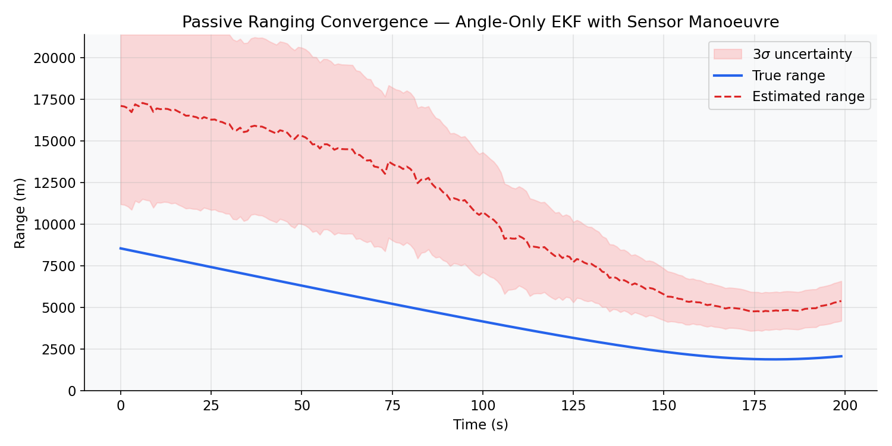

### Angle Tracking Accuracy

The same scenario showing azimuth and elevation tracking. Angular states are directly observed and track tightly from the first measurement:

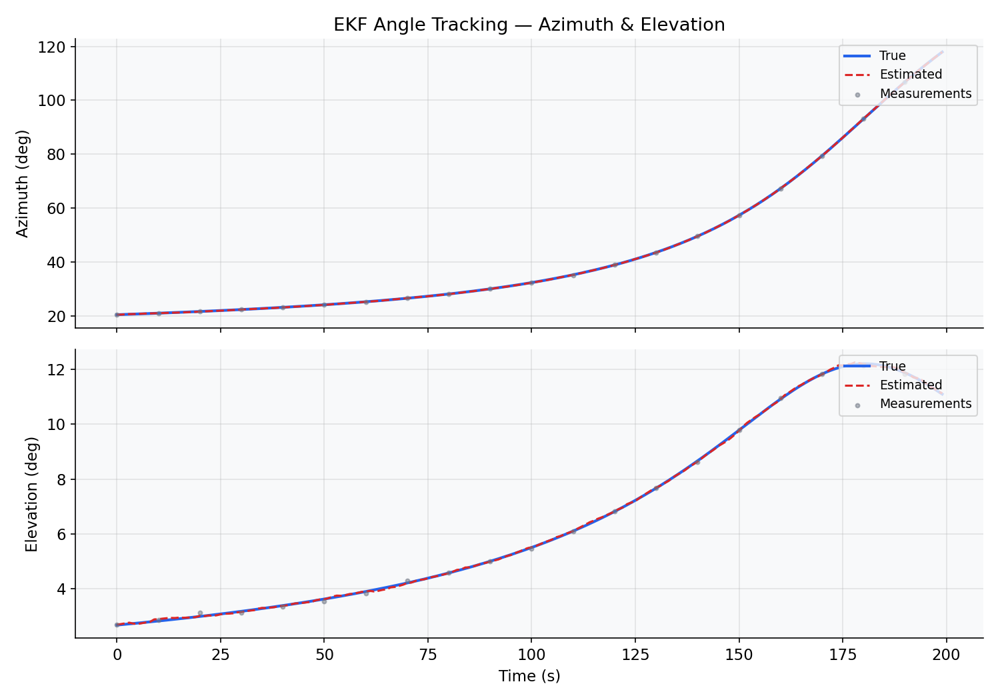

### Covariance Evolution

Position and velocity uncertainties shrink over time as measurements are incorporated. Note the log scale — position uncertainty drops by over an order of magnitude:

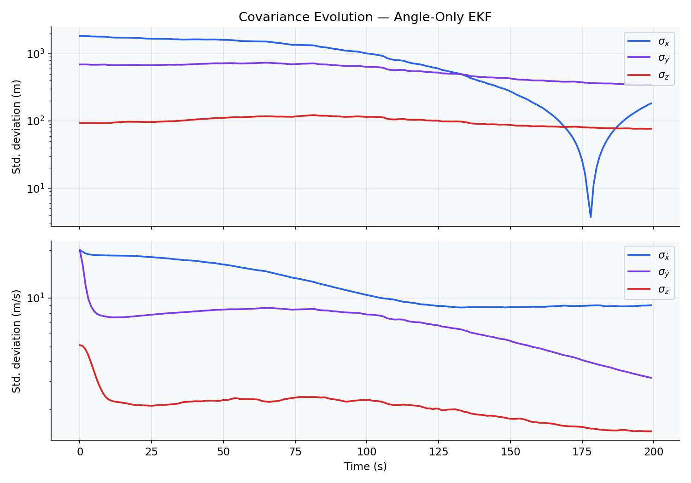

### Multi-Sensor LOS Triangulation

Three sensors at known positions observe a target. Their lines of sight are intersected using least-squares to produce a 3D position estimate:

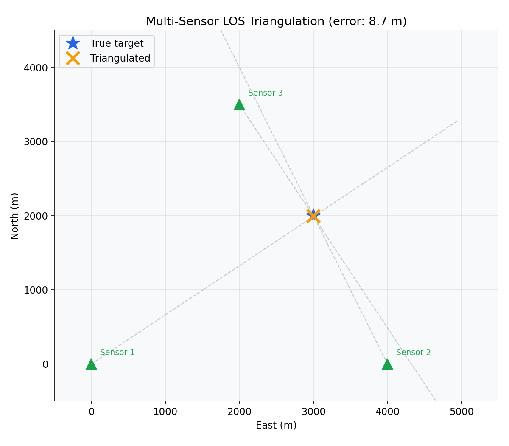

### GNN Data Association

The Hungarian algorithm finds the globally optimal assignment between tracks and measurements by minimizing total cost. Left: raw cost matrix. Right: optimal assignment (blue boxes) with costs:

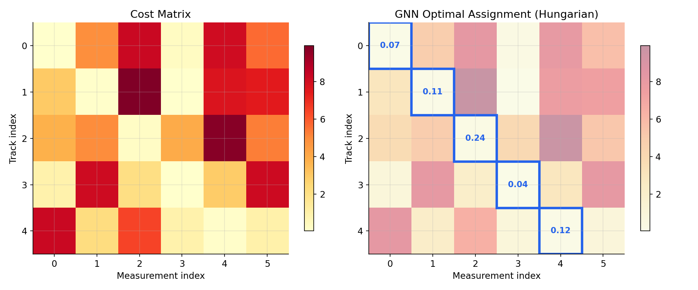

### GM-PHD Multi-Target Tracking

Three targets with staggered birth/death times tracked by the Gaussian Mixture PHD filter. The bottom panel shows estimated vs. true target count — the filter automatically detects target appearances and disappearances:

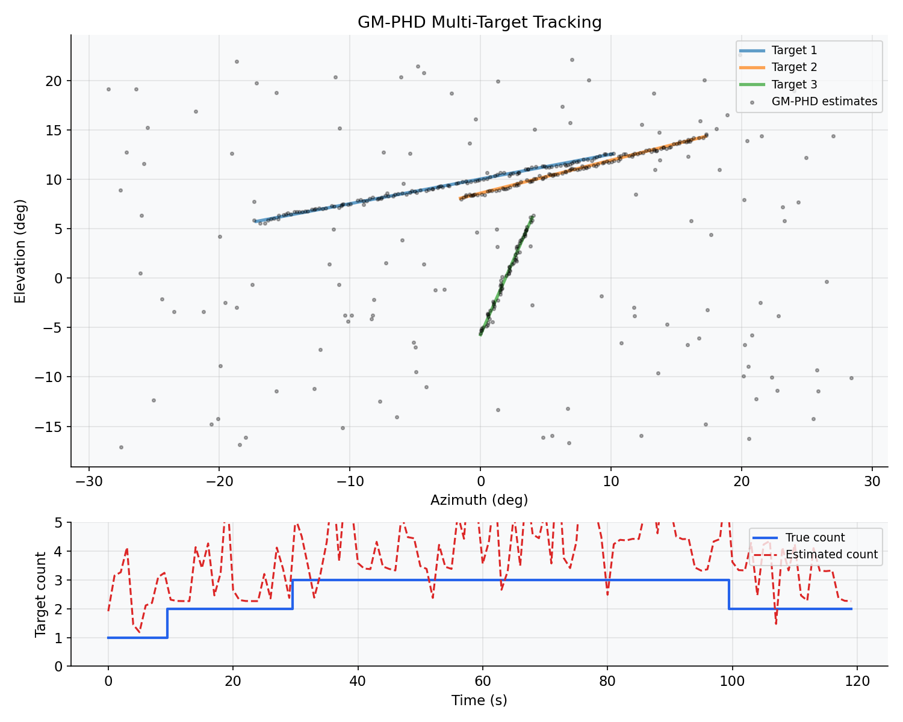

---

## Project Structure

```
angle_only/
├── CMakeLists.txt
├── README.md
├── include/angle_only/
│   ├── angle_only.hpp              # Single-include convenience header
│   ├── core/
│   │   ├── types.hpp               # Eigen type aliases (row-major)
│   │   ├── constants.hpp           # Math constants, filter defaults
│   │   ├── state.hpp               # MSCState, CartesianState
│   │   ├── detection.hpp           # Detection, SensorPose, LOSMeasurement
│   │   └── concepts.hpp            # C++20 concepts
│   ├── coords/
│   │   ├── transforms.hpp          # Coordinate conversions + Jacobians
│   │   ├── frames.hpp              # Sensor ↔ world frame transforms
│   │   └── angle_wrap.hpp          # wrap_to_pi, angle_diff
│   ├── motion/
│   │   ├── cv.hpp                  # Constant Velocity (6D Cartesian)
│   │   ├── ca.hpp                  # Constant Acceleration (9D)
│   │   ├── ct.hpp                  # Coordinated Turn (7D)
│   │   └── constant_velocity_msc.hpp  # Constant Velocity MSC (6D)
│   ├── measurement/
│   │   ├── msc_measurement.hpp     # [az, el] from MSC state
│   │   └── spherical_measurement.hpp  # [az, el] from Cartesian state
│   ├── filters/
│   │   ├── msc_ekf.hpp             # MSC Extended Kalman Filter
│   │   ├── ekf.hpp                 # Generic template EKF<N,M>
│   │   └── gmphd.hpp               # GM-PHD multi-target filter
│   ├── association/
│   │   ├── gating.hpp              # Mahalanobis gating
│   │   ├── gnn.hpp                 # Hungarian & Auction assignment
│   │   └── jpda.hpp                # Joint Probabilistic Data Association
│   ├── fusion/
│   │   ├── triangulate_los.hpp     # LOS triangulation
│   │   └── static_detection_fuser.hpp  # Multi-sensor fusion
│   └── gpu/
│       └── dispatch.hpp            # CPU/CUDA batch dispatch
├── src/                            # Implementation files
├── python/
│   ├── CMakeLists.txt              # pybind11 build
│   ├── src/                        # C++ binding sources
│   └── angle_only/
│       ├── __init__.py             # Package entry point
│       ├── compat.py               # MATLAB-compatible aliases
│       ├── filters_py.py           # Pythonic filter wrappers
│       ├── fusion_py.py            # Pythonic fusion wrappers
│       └── visualization.py        # 3D Plotly visualization
├── tests/
│   ├── cpp/                        # 54 Catch2 tests
│   ├── python/                     # pytest suite
│   └── integration/                # End-to-end scenarios
├── examples/
│   ├── cpp/passive_ranging.cpp
│   └── python/
├── scripts/
│   └── generate_plots.py           # Generate documentation plots
├── docs/images/                    # Generated plot PNGs
└── benchmarks/
```

---

## MATLAB Migration Guide

This library is a C++ reimplementation of MATLAB's angle-only tracking functions. The following table maps MATLAB names to their C++ equivalents:

| MATLAB | C++ | Python |
|--------|-----|--------|
| `trackingMSCEKF` | `aot::filters::MSCEKF` | `aot.MSCEKF` |
| `initcvmscekf` | `aot::filters::initcvmscekf()` | `aot.initcvmscekf()` |
| `constvelmsc` | `aot::motion::ConstantVelocityMSC::predict()` | `aot.motion.ConstantVelocityMSC` |
| `constvelmscjac` | `aot::motion::ConstantVelocityMSC::jacobian()` | — |
| `cvmeasmsc` | `aot::measurement::MSCMeasurement::predict()` | `aot.measurement.MSCMeasurement` |
| `cvmeasmscjac` | `aot::measurement::MSCMeasurement::jacobian()` | — |
| `constvel` | `aot::motion::ConstantVelocity` | `aot.motion.ConstantVelocity` |
| `constacc` | `aot::motion::ConstantAcceleration` | `aot.motion.ConstantAcceleration` |
| `constturn` | `aot::motion::CoordinatedTurn` | `aot.motion.CoordinatedTurn` |
| `triangulateLOS` | `aot::fusion::triangulate_los()` | `aot.triangulate_los()` |

Python also provides MATLAB-style aliases via `angle_only.compat`:

```python
from angle_only.compat import constvelmsc, initcvmscekf, triangulateLOS
```

---

## API Summary

### Filter Lifecycle

```cpp
// 1. Initialize
auto ekf = aot::filters::initcvmscekf(detection);

// 2. Configure
ekf.motion_model().set_process_noise_intensity(1e-3);
ekf.measurement_model().set_noise(R);
ekf.set_store_history(true);  // for RTS smoothing

// 3. Track
ekf.predict(dt);
ekf.correct(z, R);

// 4. Query
ekf.state();       // Vec6: [az, el, 1/r, ȧz, ėl, d(1/r)/dt]
ekf.covariance();  // Mat6: 6x6 covariance
ekf.distance(z, R);   // Mahalanobis distance
ekf.likelihood(z, R); // Gaussian measurement likelihood

// 5. Smooth (optional, requires history)
auto smoothed = ekf.smooth();  // RTS fixed-interval smoother
```

### Multi-Target Tracking

```cpp
aot::filters::GMPHD::Config cfg;
cfg.p_survival = 0.99;
cfg.p_detection = 0.9;
cfg.clutter_rate = 1e-5;
cfg.extraction_threshold = 0.5;

aot::filters::GMPHD phd(cfg);
phd.set_transition(f, f_jac, Q_fn);
phd.set_measurement(h, h_jac, R);

// Each timestep
phd.add_birth(birth_components);
phd.predict(dt);
phd.correct(measurements);
phd.merge();
phd.prune();

auto targets = phd.extract();  // components with weight > threshold
double n_targets = phd.estimated_target_count();
```

### Data Association

```cpp
// Gating
auto gated = aot::association::gate(predicted_z, measurements, S, threshold);

// Global Nearest Neighbor
auto result = aot::association::gnn_assign(cost_matrix, gate_threshold);
for (auto [track_idx, meas_idx] : result.assignments) { ... }

// JPDA
auto jpda = aot::association::jpda_probabilities(likelihood_matrix,
                                                   p_detection, p_gate, clutter_density);
// jpda.beta(i, j) = P(measurement j originated from track i)
```

---

## Build Options

| CMake Option | Default | Description |
|-------------|---------|-------------|
| `AOT_BUILD_TESTS` | `ON` | Build Catch2 test suite |
| `AOT_BUILD_PYTHON` | `OFF` | Build pybind11 Python bindings |
| `AOT_BUILD_BENCHMARKS` | `OFF` | Build performance benchmarks |
| `AOT_ENABLE_CUDA` | `OFF` | Enable CUDA GPU acceleration |

### Dependencies

- **CMake** 3.24+
- **C++20** compiler (GCC 11+, Clang 14+, MSVC 2022+)
- **Eigen 3.4** (fetched automatically via FetchContent)
- **Catch2 v3.5.2** (fetched automatically, tests only)
- **pybind11 v2.12.0** (fetched automatically, Python bindings only)
- **CUDA Toolkit** (optional, GPU acceleration only)

---

## License

See [LICENSE](LICENSE) for details.
