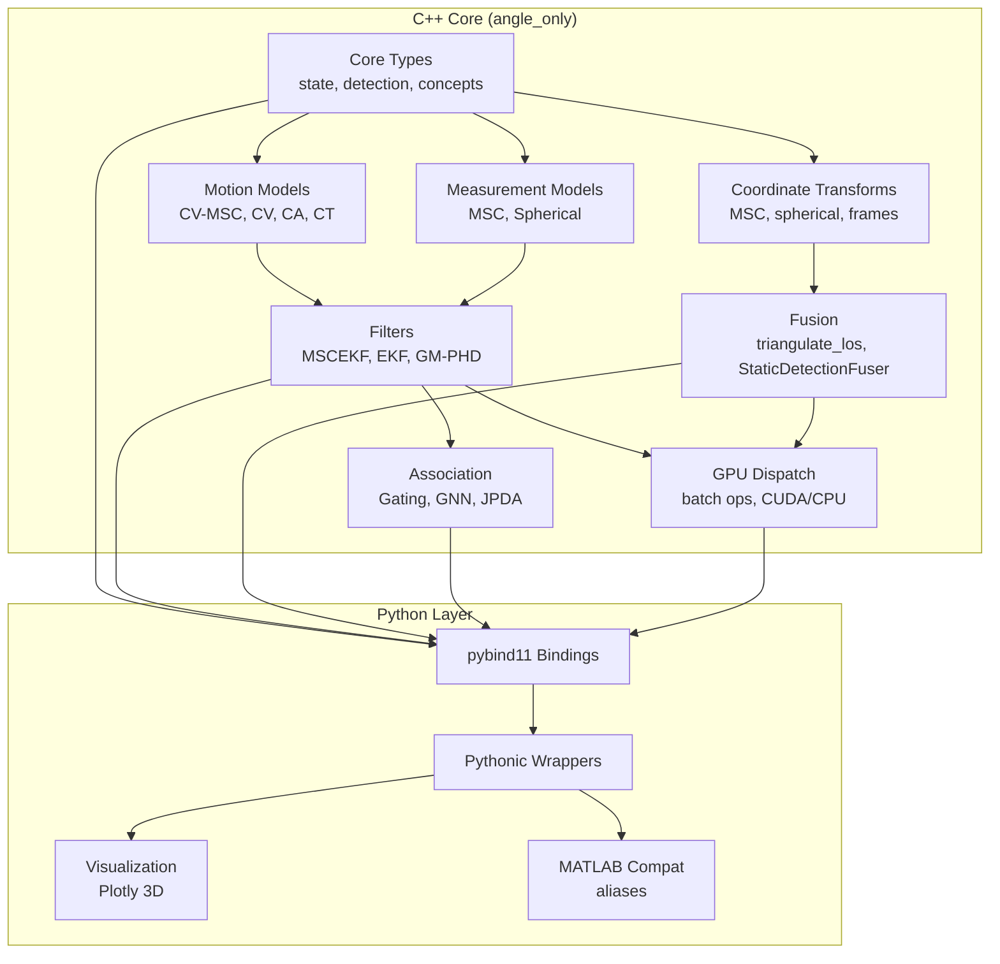

# Architecture

## System Overview



## Key Design Decisions

### C++20 Concepts for Zero-Cost Polymorphism

```cpp
template <typename M>
concept MotionModel = requires(const M& m, const Vec6& state, double dt) {
    { m.predict(state, dt) } -> std::convertible_to<Vec6>;
    { m.jacobian(state, dt) } -> std::convertible_to<Mat6>;
    { m.process_noise(dt) } -> std::convertible_to<Mat6>;
};
```

No vtable overhead in hot filter loops — the compiler generates specialized code for each model.

### Modified Spherical Coordinates (MSC)

The MSC state vector `[az, el, 1/r, az_rate, el_rate, inv_range_rate]` is specifically designed for angle-only tracking where range is initially unobservable:

- Azimuth and elevation are directly measured
- Inverse range (1/r) avoids singularity at infinite range
- Linear measurement model: H = [I₂ 0₂ₓ₄]

### Runtime GPU Dispatch

```cpp
if (gpu::should_use_gpu(batch_size)) {
    gpu::batch_predict_cuda(states, covs, F, Q, dt);
} else {
    gpu::batch_predict(states, covs, F, Q, dt);  // CPU fallback
}
```

Single binary works with or without GPU. Auto-selects based on batch size threshold (64 by default).

### Row-Major Matrices for Python Interop

All matrices use `Eigen::RowMajor` storage, matching numpy's default layout. This avoids copies when passing data between C++ and Python via pybind11.
